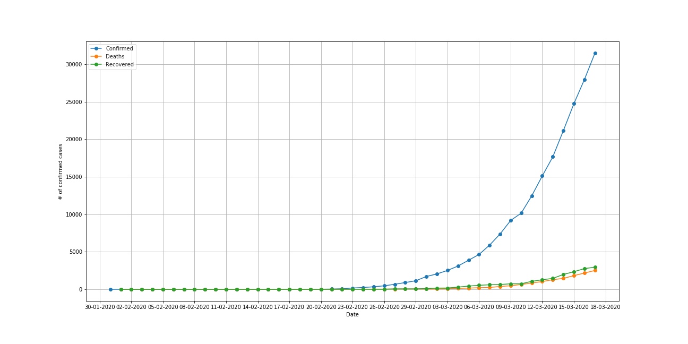
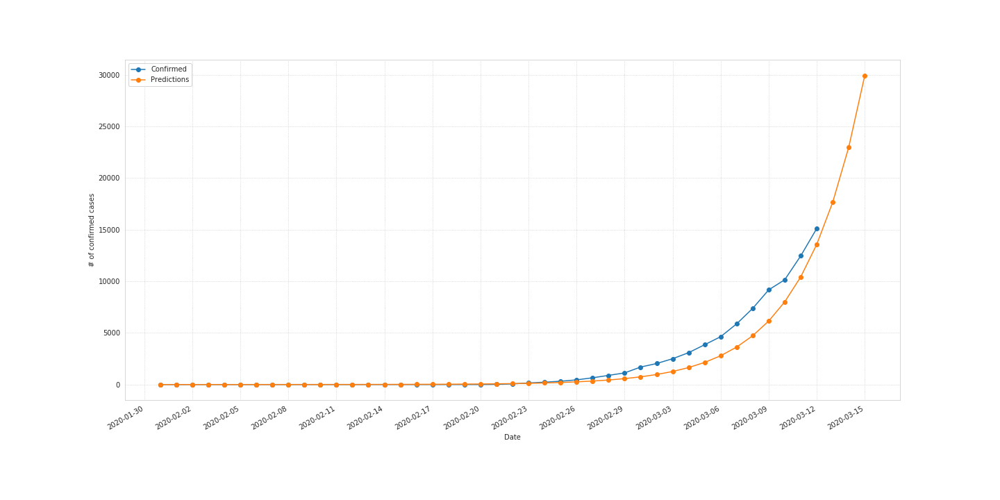
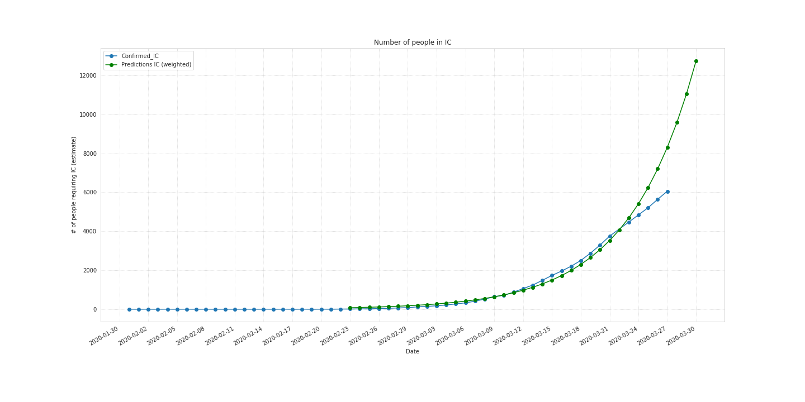
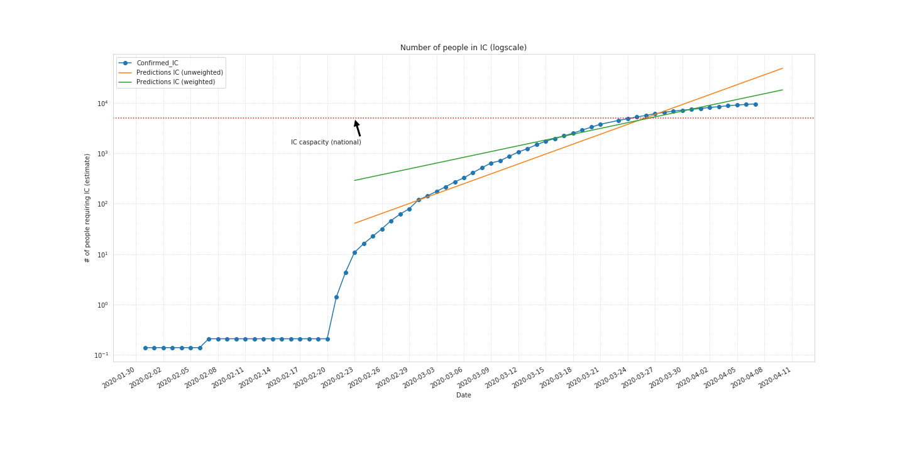
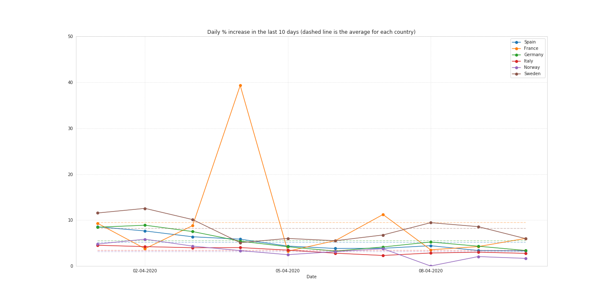
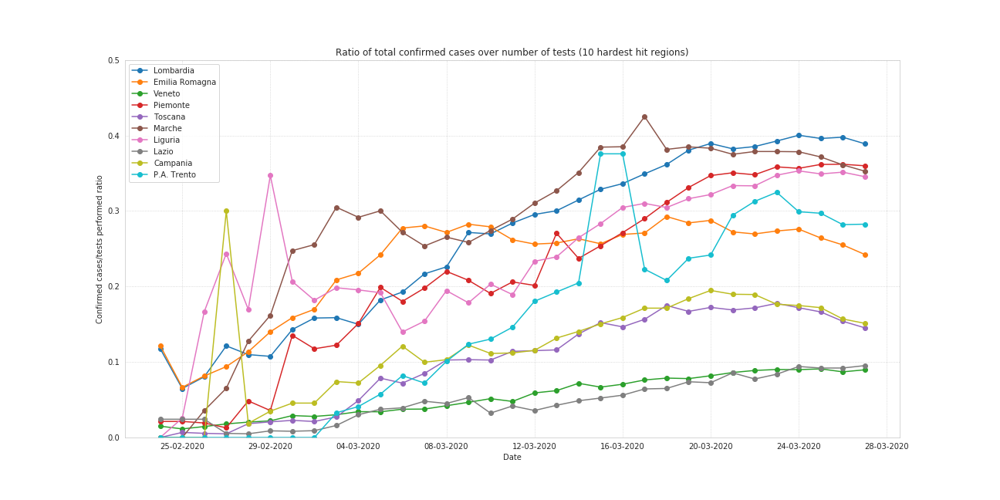

# COVID-2019 data analysis

**Updated 09/04/2020**

In this repo I use a jupyter notebook to plot latest data available from health organizations around the world (See Section [Data source](#Data-source) for more information on the origin of data) and include a simple model which fits an exponential curve to the data.

I'm updating this repository every morning at around 8:30 (CET time).

## Data source

Data come from this repo: https://github.com/CSSEGISandData/COVID-19.git, if you want to be sure to have the latest data please add that one as a remote for the **master** branch (and then merge on the **notebooks** branch)!

## Plots

Plots are generated automatically from the notebook.

### Daily data (Italy)

### Estimate of new cases in the near future (Italy)

### Estimate number of people requiring Intensive Care (Italy)

Aside from the raw number of people being hospitalized because of the disease, an important aspect is the number of people who will require to be intubated or receive specialized, life-saving treatment in Intensive Care (IC) which requires instruments which are very limited in number.

This plot assumes that 10% of all infected people will require such treatment. The red dashed horizontal line represents the country's capacity for those treatment. Once it's saturated people will no longer be able to receive the appropriate treatment, and the death toll will most likely increase dramatically.

### Europe data, with dates aligned

In the plot below I adjusted the dates of Italy, the country where first the virus started to spread significantly, Sweden and Norway in order to show the similarities between the trends in those and other european countries.

Data from Italy has been "delayed" by 9 days and truncated (the latest data is omitted in order to improve the other lines' visibility and the plot overall's interpretability). The situation you see in Spain, France and Germany is at the moment the same that was in Italy nine days ago.

Data from Norway and Sweden has instead been "anticipated" by a few days (as if the trend had begun roughly at the same time of other countries).

### Daily % increase

% of new cases with respect to the previous day for different countries in Europe, in the last 10 days. Dashed lines represent the average for each country.

### Ratio of cases over number of tests

It is difficult to assess the effectiveness of measures such as lockdown and
overall social distancing, considering that the number of actual cases itself is
hard to estimate with precision since it depends on several factors.

An indicator that might be useful to shed some light on the actual progression
of the outbreak is the ratio between the number of cases and the number of
tests. The intuition behind this is the increase of number of new cases is not
only due to the actual spread of the disease but also significantly to how many
people are tested. While not exact, since only people who have a reason to
suspect that they have been infected are tested, and not the general population,
the downward slope of the last few days in Italy for the hardest hit regions 
seems to suggest that the measures taken the 8th and 9th of March are starting
to yield positive effects.

