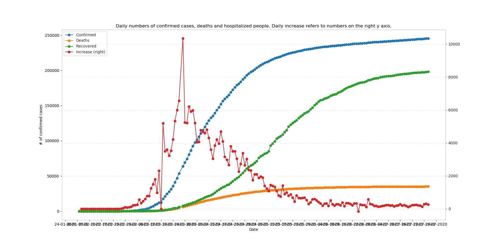
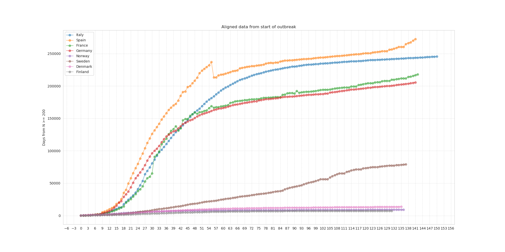
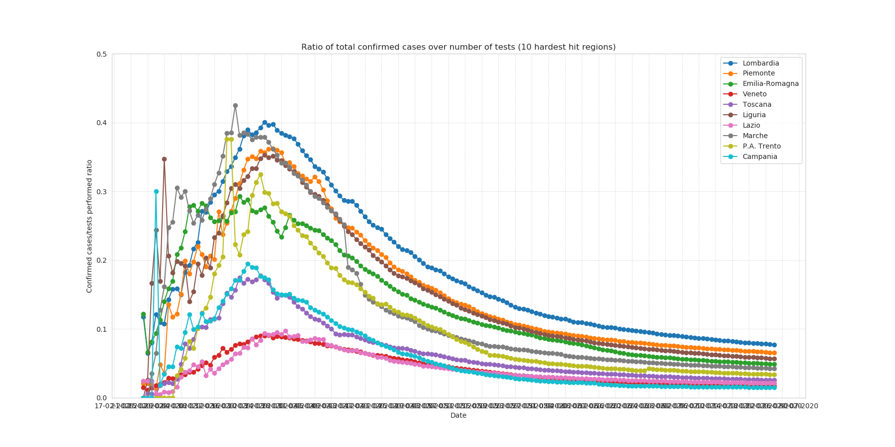

# COVID-2019 data analysis

**Updated 23/06/2020**

In this repo I use a jupyter notebook to plot latest data available from health organizations around the world (See Section [Data source](#Data-source) for more information on the origin of data) and include a simple model which fits an exponential curve to the data.

I'm updating this repository every morning at around 8:30 (CET time).

## Data source

Data for all countries come from this repo: https://github.com/CSSEGISandData/COVID-19.git, which is included as a submodule in folder `data-world`. Data for italian regions is included in submodule `data-ita` (remote repo https://github.com/pcm-dpc/COVID-19.git. Make sure to clone recursively both submodules.

## Plots

Plots are generated automatically from the notebook.

### Daily data (Italy)

### Europe data, with dates aligned

In order to try and give a fair comparison on how the disease is spreading, I
plotted the number of confirmed cases starting for each country from the date
when such number had crossed a threshold (arbitrarily set at 200).

### Ratio of cases over number of tests

It is difficult to assess the effectiveness of measures such as lockdown and
overall social distancing, considering that the number of actual cases itself is
hard to estimate with precision since it depends on several factors.

An indicator that might be useful to shed some light on the actual progression
of the outbreak is the ratio between the number of cases and the number of
tests. The intuition behind this is the increase of number of new cases is not
only due to the actual spread of the disease but also significantly to how many
people are tested. While not exact, since only people who have a reason to
suspect that they have been infected are tested, and not the general population,
the downward slope of the last few days in Italy for the hardest hit regions 
seems to suggest that the measures taken the 8th and 9th of March are starting
to yield positive effects.

